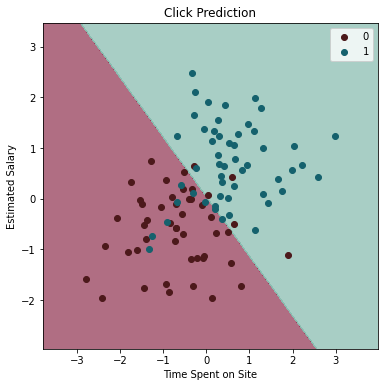

# Customer-Clicks-Predictor
The objective of this kernel is to create a classification model which predicts customer clicks based on two parameters:
1. Time spent on site
2. Estimated salary

This project is based on a tutorial by [Dr. Ryan Ahmed](https://www.udemy.com/user/ryan-ahmed/).
 
Our Classification Analysis Kernel consists of 6 steps:

### Step 1 Import the Libraries and Data:
in addition to the scikit-learn library which we use to perform the classification analysis, we also use several other packages and modules:

-**Pandas**:used for data structures and operations for manipulating numerical tables
-**Numpy**: used for numerical analysis
-**matplotlib.pyplot**: used for plotting data
-**seaborn**: used for data visualization (used on top of matplotlib library)
-**sklearn**: our main ML library - used to scale the data, to create the model, and to visualize the results

We import the data from a csv file, and we load it into a pandas DataFrame object.

### Step 2 - Visualize Data:
In this step we check our data for null values and check if there is any correlation between the variables.

### Step 3: Clean Data:
We drop the 'Names', 'emails', 'Country' columns, and we create the inputs set 'X' and the target set 'y'.
Then we scale the data using sklearn's StandardScaler.

### Step 4 - Train Model: 
We split our data set into a training and testing sets. We use 20% for testing the regressor. Then we fit our model using the training set.

### Step 5 - Test Model:
We predict the results of the testing set and we create a confusion model using our prediction and the testing set. Then we create a classification report to evaluate our model.

### Step 6 - Visualize Results:
We create a mesh grid and plot the results of our prediction. The color of the grid is colored based on our prediction, and the color of the data points is based on their true outcome. In this way it is easy to visualize the way the model works.

